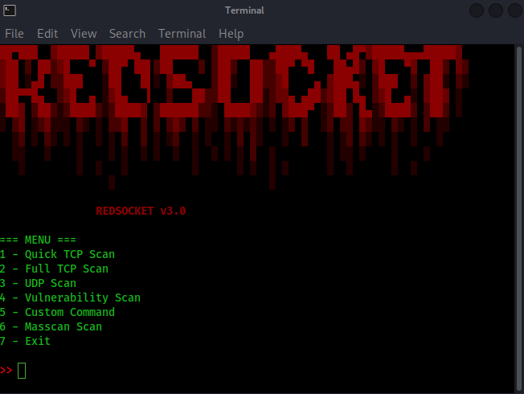
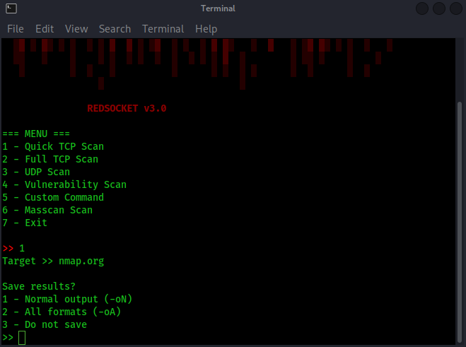
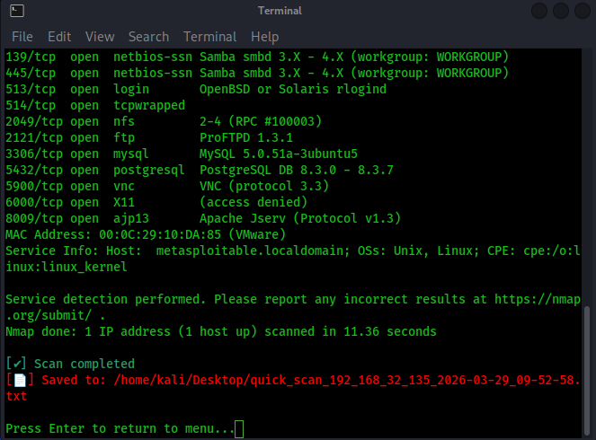

# RedSocket v3.0

RedSocket is an interactive command-line wrapper for Nmap and Masscan designed to simplify and accelerate real-world network reconnaissance.

It provides preconfigured scan profiles, automatic result management, and a clean menu-driven interface for fast and reliable scanning without memorizing complex command-line flags.

---

## Why RedSocket?

While Nmap is extremely powerful, using it efficiently during live engagements or labs can be slow and error-prone. RedSocket focuses on speed, clarity, and usability.

It provides:

* Prebuilt scan profiles for common reconnaissance scenarios
* Automatic result saving with timestamps
* Real-time highlighting of critical services (SSH, RDP, FTP, etc.)
* Session logging for reproducibility
* Optional high-speed scanning using Masscan

RedSocket is designed for:

* Penetration testers
* CTF players
* Cybersecurity students
* Lab and practice environments

---

## Features

### Scan Profiles

RedSocket includes multiple predefined scanning modes:

* **Quick TCP Scan** – Fast scan of common ports with service detection
* **Full TCP Scan** – Complete 1-65535 port scan
* **UDP Scan** – Scan of top UDP ports
* **Vulnerability Scan** – Uses Nmap NSE vulnerability scripts
* **Masscan Scan** – High-speed full-range scanning with automatic sudo detection

---

### Custom Command Mode

Advanced users can execute raw Nmap commands while still benefiting from:

* Automatic logging
* Optional result saving
* Live terminal output

---

### Critical Service Detection

During scans, RedSocket highlights sensitive or high-value services:

Example:

```
[!] CRITICAL SERVICE → SSH (22)
[!] CRITICAL SERVICE → RDP (3389)
```

This allows faster decision-making during reconnaissance phases.

---

### Automatic Result Saving

After each scan, users can choose:

* Save results in normal format (`-oN`)
* Save results in all formats (`-oA`)
* Skip saving

Files are automatically stored on the Desktop with timestamped filenames.

---

### Session Logging

All executed commands are stored in:

```
redsocket_session.log
```

This enables:

* Scan reproducibility
* Audit trails
* Strategy debugging

---

### Auto-Update System

RedSocket can check for new versions directly from GitHub and update itself when a newer release is available.

---

## Requirements

* Python 3.8+
* Nmap installed and available in PATH
* Masscan (optional but recommended)

Install dependencies on Debian-based systems:

```
sudo apt install nmap masscan
```

---

## Installation

Clone the repository:

```
git clone https://github.com/phantomsecuritydev-ctrl/RedSocket.git
cd RedSocket
python3 redsocket.py
```

---

## Example Usage

```
python3 redsocket.py
```

Select a scan profile from the menu and provide a target:

```
1
192.168.1.10
```

Example output:

```
[+] Running: nmap -F -sV 192.168.1.10
[!] CRITICAL SERVICE → SSH (22)
[✔] Scan completed
```

Results will be saved to the Desktop if enabled.

---

## Project Goals

RedSocket is **not intended to replace Nmap**.
Its goal is to make Nmap faster and easier to use in environments where:

* time is limited
* command syntax is easy to mistype
* scan results must be archived automatically

---

## Legal Notice

RedSocket does **not include or redistribute** Nmap or Masscan.
It acts solely as a wrapper that executes these tools via system commands.

This project is **not affiliated with or endorsed by** the Nmap Project.

Nmap is licensed separately under its own license:
https://nmap.org/book/man-legal.html

---

## License

This project is licensed under the **GNU General Public License v3.0**.

---

## Disclaimer

This tool is intended for educational purposes and authorized security testing only.

Unauthorized network scanning may be illegal in your jurisdiction.
The author assumes no responsibility for misuse or damage caused by this software.


## Screenshots

### User Interface


### Interface Choice -oA -oN


### Fast Scan Example



---

## Author

Daniel Di Blasi (Phantom)

GitHub:
https://github.com/phantomsecuritydev-ctrl/RedSocket
